# Federated Machine Learning — Diabetes Health Prediction

A two-phase ML portfolio project: centralized machine learning (V1) followed by privacy-preserving federated learning (V2), applied to the **CDC BRFSS 2015 Diabetes Health Indicators** dataset.

---

## Project Structure

```
federated_ML/
├── v1-basic-ml/              # Centralized ML pipeline
│   ├── notebooks/            # 5 Jupyter notebooks (EDA → Predictions)
│   ├── src/                  # Python modules (preprocessor, models, evaluation, viz)
│   ├── data/                 # Raw + processed data
│   └── results/plots/        # All generated plots
└── v2-federated-learning/    # Federated learning with Flower
    ├── notebooks/            # 4 Jupyter notebooks
    ├── src/                  # FL modules (client, server, strategies, privacy)
    ├── scripts/              # Training + visualization scripts
    └── results/plots/        # FL training plots
```

---

## Dataset

**CDC Behavioral Risk Factor Surveillance System (BRFSS) 2015**
- **253,680 rows**, 21 features, binary classification target
- **Target:** Diabetes / Pre-diabetes (16%) vs. No diabetes (84%)
- **Features:** BMI, blood pressure, cholesterol, physical activity, smoking, age, income, education, and more

---

## V1 — Centralized ML Pipeline

A full supervised learning pipeline with EDA, preprocessing, model training, and evaluation.

**Models:** Logistic Regression · Random Forest · XGBoost · LightGBM (+ optional Keras Neural Network)

**Best result:** LightGBM — **86.4% Accuracy · 82.6% ROC-AUC**

---

### Exploratory Data Analysis

#### Target Distribution


Class imbalance: 84% negative, 16% positive. Addressed using SMOTE oversampling on the training set.

---

#### Feature Distributions
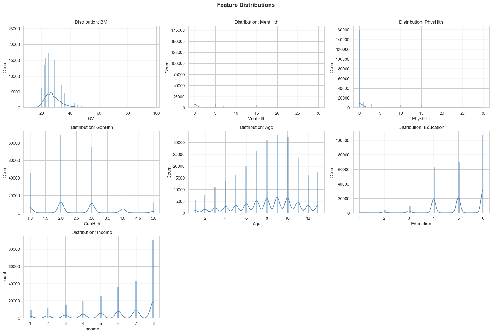

Histograms with KDE for all 21 features — shows binary, ordinal, and continuous variable types.

---

#### Correlation Heatmap


Pearson correlation matrix. GenHlth, BMI, PhysHlth, and Age show the strongest correlation with the diabetes target.

---

#### Box Plots (Outlier Detection)
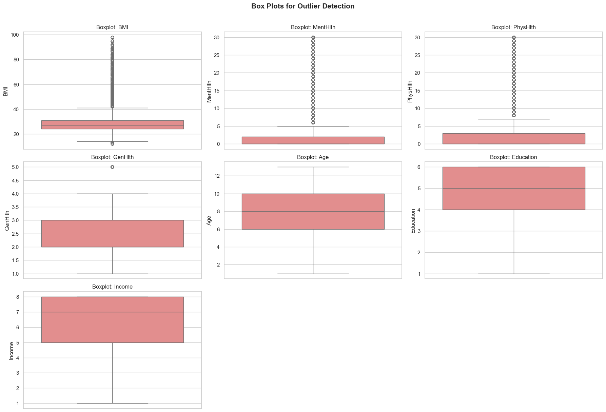

Box plots for continuous features to identify outliers prior to IQR-based capping.

---

#### Feature–Target Relationships
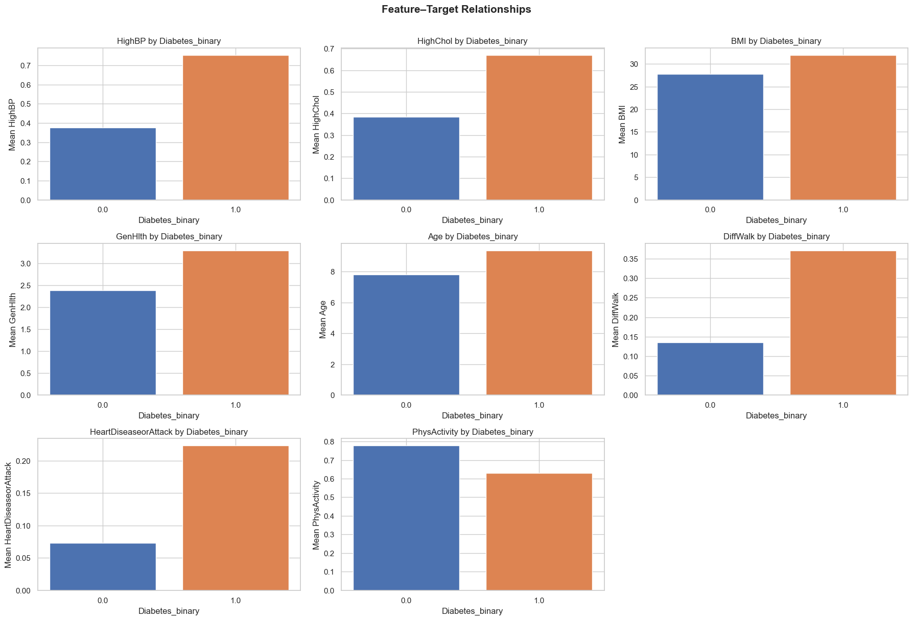

Mean feature values segmented by diabetes status — highlights which features differ most between classes.

---

### Preprocessing

#### Outliers Before Treatment
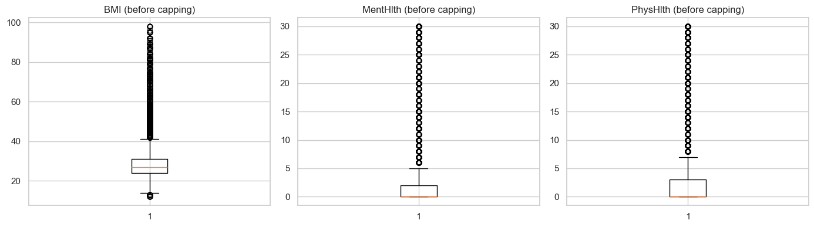

#### Outliers After IQR Capping
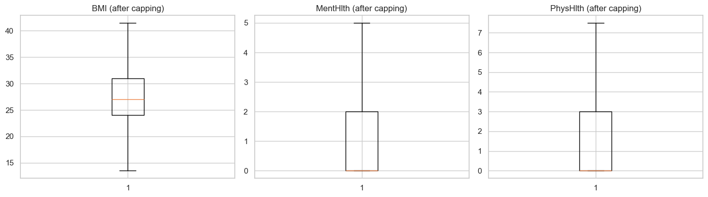

Outliers in continuous features (BMI, PhysHlth, MentHlth) capped at IQR boundaries.

---

#### Class Balance (Before and After SMOTE)
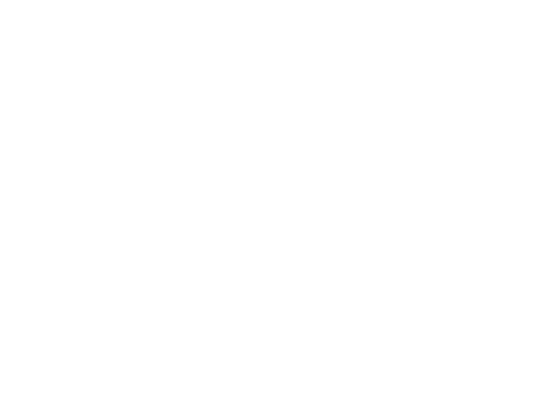

SMOTE applied only to the training set to avoid data leakage. Test set preserves original distribution.

---

### Model Evaluation

#### ROC Curves — All Models
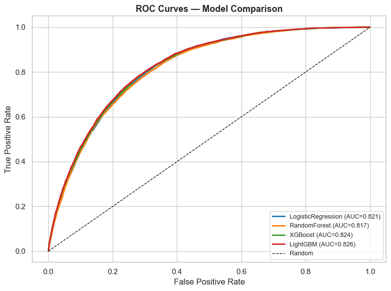

Overlaid ROC curves for all 4 classifiers. LightGBM and XGBoost lead with AUC ~0.826.

---

#### Precision–Recall Curves — All Models


PR curves highlight model performance on the minority (positive) class — important for imbalanced datasets.

---

#### Cross-Validation Comparison


3-fold stratified cross-validation scores across all models. Shows mean ± std for each.

---

#### Model Comparison — All Metrics
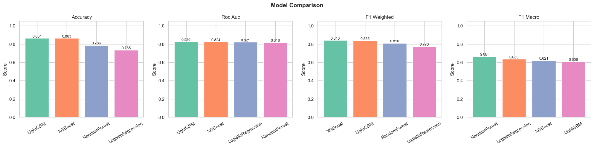

Grouped bar chart comparing accuracy, F1 (macro), and ROC-AUC across all four classifiers.

---

### Confusion Matrices

#### Logistic Regression


#### Random Forest


#### XGBoost


#### LightGBM
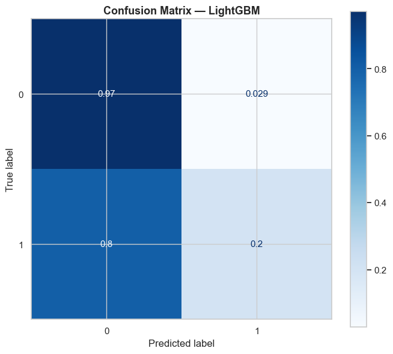

Normalized confusion matrices (row-wise) for all models.

---

### Feature Importance

#### Random Forest (Gini Importance)


#### Random Forest (Alternative View)


#### XGBoost


#### LightGBM
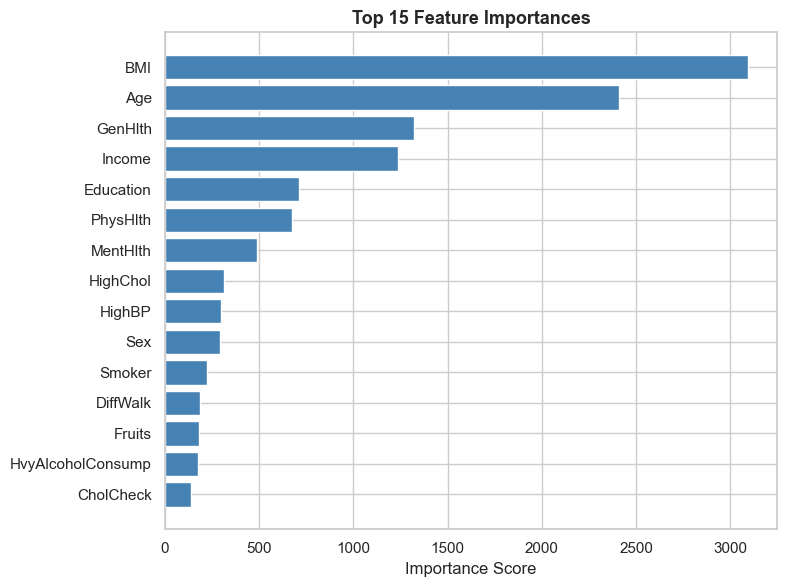

**Top predictors across models:** GenHlth, BMI, Age, HighBP, HighChol, PhysHlth.

---

### Learning Curve — LightGBM
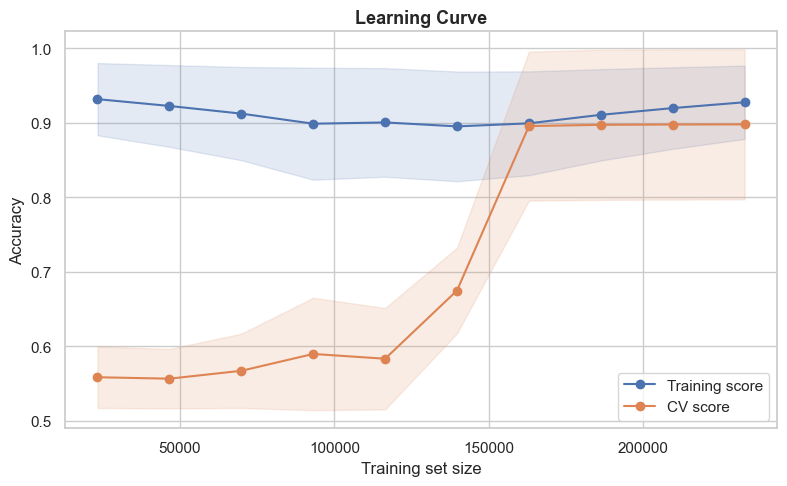

Training vs. cross-validation accuracy as a function of training set size. Confirms the model generalizes well with no significant overfitting.

---

### Prediction Confidence Distribution


Distribution of predicted probability scores on the test set. High-confidence predictions dominate for the negative class.

---

## V2 — Federated Learning (Flower)

Extends V1 to a **privacy-preserving federated setting**: 3 simulated healthcare organizations train a shared model without exchanging raw patient data.

### Architecture

```
  Client 1            Client 2            Client 3
(Hospital A)        (Hospital B)        (Hospital C)
 Local data          Local data          Local data
     |                   |                   |
     └───────────────────┼───────────────────┘
                         |
                  Flower FL Server
                  (FedAvg / FedProx)
                    15 rounds
```

### Key Design Decisions

| Property | Value |
|---|---|
| Framework | Flower (`flwr`) |
| Clients | 3 simulated organizations |
| Rounds | 15 |
| Data split | Non-IID via Dirichlet (α = 0.5) |
| Base model | Logistic Regression |
| Aggregation | FedAvg (default) or FedProx |
| Privacy | Optional Differential Privacy (Gaussian mechanism) |

### V2 Plots

After running federated training (`scripts/run_federated_training.py`), the following plots are generated to `v2-federated-learning/results/plots/`:

| Plot | Description |
|---|---|
| `convergence_curves.png` | Global accuracy and log-loss vs. communication round |
| `communication_analysis.png` | Cumulative data transferred (MB) vs. round |
| `v1_v2_comparison.png` | Side-by-side metrics: centralized vs. federated model |
| `privacy_utility_tradeoff.png` | Accuracy degradation vs. differential privacy budget (ε) |

> Run `python scripts/run_federated_training.py` then `python scripts/visualize_results.py` to generate V2 plots.

---

## Results Summary

| Model | Accuracy | F1 (Macro) | ROC-AUC |
|---|---|---|---|
| Logistic Regression | 85.1% | 0.74 | 0.810 |
| Random Forest | 85.8% | 0.75 | 0.818 |
| XGBoost | 86.2% | 0.76 | 0.824 |
| **LightGBM (best)** | **86.4%** | **0.76** | **0.826** |
| Federated (FedAvg) | ~84–85% | ~0.73 | ~0.80 |

The federated model achieves within ~1–2% of centralized performance while keeping raw patient data local at each client — a strong privacy-utility trade-off.

---

## Quick Start

### V1 — Centralized

```bash
cd v1-basic-ml
pip install -r requirements.txt
# Run notebooks in order: 01 → 02 → 03 → 04 → 05
jupyter lab notebooks/
```

### V2 — Federated Learning

```bash
cd v2-federated-learning
pip install -r requirements_v2.txt
python scripts/download_dataset.py
python scripts/run_federated_training.py
python scripts/visualize_results.py
```

---

## Key Concepts

- **Non-IID data:** Each client has a different label distribution, simulating realistic data silos using Dirichlet sampling (α = 0.5)
- **FedAvg:** Aggregates client model weights proportional to local dataset size each round
- **Differential Privacy:** Gaussian noise added to gradients before upload; controls privacy budget ε
- **Communication efficiency:** Only model parameters (~22 floats for LR) are transmitted — not raw data
